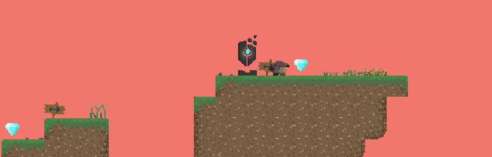

# 🕹️ Moledy  

 <!-- replace with your GIF banner or screenshot -->  

**Moledy** is a **movement-focused, exploration-centric arcade platformer** built on our **custom Sol Engine**.  
You play as a baby mole separated from your family — dig, dash, and climb your way home while evading enemies and discovering hidden gems.  

---

## 👥 Team Moledy
- **Jet Ang Jie Le** – Data Engineer / UI / Debugging  
- **Muhammad Dzulhafiz Bin Abdul Rahim** – Graphics / UI  
- **Xavier Lye Pin Liang** – Architecture, SOLs Tech Lead  
- **Chong Joey Jing Wen** – Level Editor / UI  
- **Woo Derrick Ze Bin** – Debugging / Level Editor  
- **Yong Kai Yi, Jeryl** – Art / Audio, SOLs Project Manager  
- **Yong Yun Jing** – Animation / Scripting, SOLs Design Lead  

---

## 🎮 Game Concept
- Play as a mole with unique **digging mechanics**: downward, sideways, and upward.  
- **Momentum-based dashing** allows climbing mountains and evading foxes.  
- **Collect gems** to gain time bonuses and leaderboard advantage.  
- **Enemies (foxes)** patrol and chase players on detection.  
- **End portal** completes the level and progresses the game.  
- **Checkpoints (monoliths)** save progress between deaths.  

---

## 🕹 Controls
### Keyboard
- **Movement**: `A` / `D` (Left / Right), `SPACE` (Jump)  
- **Digging**: `S` (Down), `A/D` (Sideways), `W` (Up)  
- **Dashing**: `Q` (Left), `E` (Right)  
- **Pause**: `ESC`  
- **Debug Reset**: `K`  

### Xbox Controller
- **Movement**: Left Stick (L/R), `A` (Jump)  
- **Digging**: LS Down (Dig), LS Left/Right (Sideways), LS Up (Up)  
- **Dashing**: LT (Left), RT (Right)  

---

## ✨ Features Grid
| 🕳️ Digging System | 🦊 Enemy AI | 💎 Collectibles | 🗿 Checkpoints |
|------------------|-------------|----------------|----------------|
| 3-stage digging with physics-based momentum | Fox patrol, detection, chase, and stun | Hidden gems reward bonus time | Monolith respawn saves progress |

| 🏆 Leaderboard | 🎨 Custom Engine | 🛠️ Editor Tools | 🎵 Audio |
|----------------|-----------------|-----------------|-----------|
| Save & rank best times | ECS-based Sol Engine with serialization | In-editor sandbox with hierarchy, inspector, particles, tilemap | FMOD-powered sound system |

---

## 🔑 Cheat Codes
### Game
- `CTRL + J` → Unlimited Jump  
- `CTRL + G` → Godmode / Noclip  
- `CTRL + - / +` → Adjust Timer (-10s / +10s)  
- `CTRL + R` → Reset Timer  
- `CTRL + T + [0/1]` → Teleport (Spawn/Portal)  
- `ALT + 0` → Show FPS  

### Editor
- `ALT` → Show colliders  
- `Right CTRL` → Maximize window  

---

## 🐛 Known Bugs
- Mole occasionally stuck underground → workaround: jump + move.  
- Rare respawn issues after multiple deaths.  
- Dashing requires no directional input.  
- Fox respawn may fail after repeated collisions.  

---

## 🛠️ Sol Engine Editor
Moledy was built using our **custom Sol Engine**, featuring an in-house level editor.  

### Core Panels
- **Hierarchy** – manage entities in scene  
- **Inspector** – add/configure components  
- **Scene Window** – 2D/3D view, play/pause, tile editing
- **File & Asset Browsers** – drag & drop textures, audio, shaders

- **Debug Log** – FPS & resource monitoring  

### Tools
- **Tile Map Editor** with snapping and ghost previews  
- **Layering System** for entity order control  
- **Guizmos** (`Q` off, `W` translate, `E` scale, `R` rotate)

- **Particle Editor** with live preview & JSON saving

---

## ⚙️ Technical Design (TDD Highlights)
- **Entity Component System (ECS)** for modular gameplay  
- **Scene Stack System** for clean state transitions  
- **Serialization** via RapidJSON (save/load, prefabs)  
- **Debugging Tools**: logging, asserts, FPS overlay  
- **Rendering**: OpenGL batch rendering pipeline  
- **Physics**: Rigidbody + collisions  
- **Libraries Used**: FMOD, ImGui, GLEW, GLFW, GLM, stb, spdlog  

---

## 📸 Screenshots / Demo

---

⚠️ **Note on Source Code Availability**  
Due to academic and licensing sensitivities, the source code for *Moledy / Sol Engine* is not publicly available in this repository.  
This portfolio showcases the **design documentation, technical breakdowns, and gameplay highlights** to demonstrate my contributions in engine development, debugging, asset management, and production. Please contact me directly if you’d like to discuss the technical details further.

© 2023 DigiPen Institute of Technology Singapore.  
FMOD Sound System © FireLight Technologies Pty Ltd (1998–2020).  
